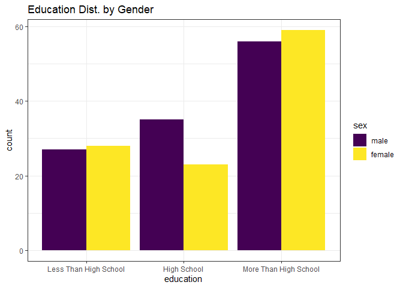
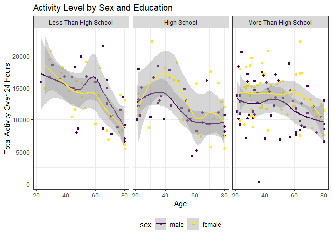
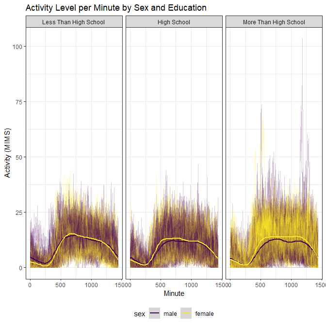
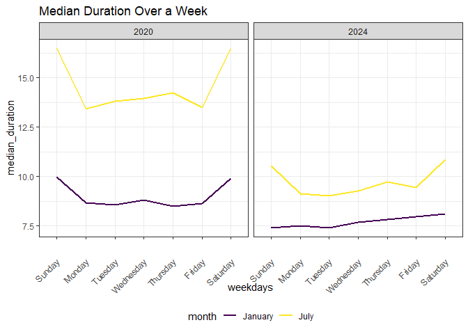
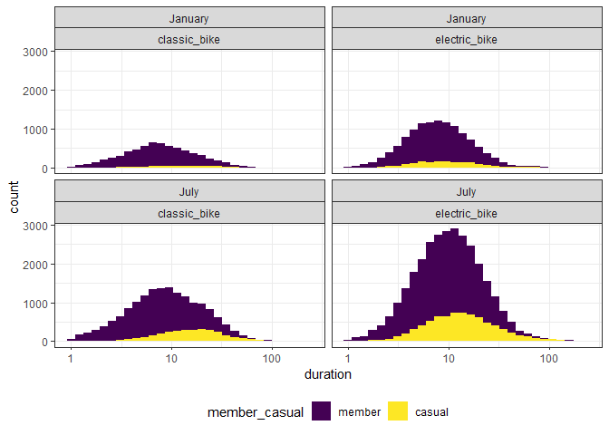

p8105_hw3_ss7332
================
Sean Sorek
2024-10-14

# Problem 2

``` r
covar <- read_csv("data/nhanes_covar.csv", skip = 4) |> na.omit() |>
  mutate(
    sex = factor(sex, 1:2, c("male", "female")),
    education = factor(education, 1:3, 
                       c("Less Than High School",
                         "High School",
                         "More Than High School"))) |>
  filter(age >= 21)
accel <- read_csv("data/nhanes_accel.csv") |>
  pivot_longer(
    starts_with("min"),
    names_prefix = "min",
    names_to = "minute",
    values_to = "MIMS") |>
  mutate(minute = as.integer(minute))

full_ac <- inner_join(covar, accel, by = join_by(SEQN)) |> glimpse()
```

    Rows: 328,320
    Columns: 7
    $ SEQN      <dbl> 62161, 62161, 62161, 62161, 62161, 62161, 62161, 62161, 6216…
    $ sex       <fct> male, male, male, male, male, male, male, male, male, male, …
    $ age       <dbl> 22, 22, 22, 22, 22, 22, 22, 22, 22, 22, 22, 22, 22, 22, 22, …
    $ BMI       <dbl> 23.3, 23.3, 23.3, 23.3, 23.3, 23.3, 23.3, 23.3, 23.3, 23.3, …
    $ education <fct> High School, High School, High School, High School, High Sch…
    $ minute    <int> 1, 2, 3, 4, 5, 6, 7, 8, 9, 10, 11, 12, 13, 14, 15, 16, 17, 1…
    $ MIMS      <dbl> 1.10600000, 3.11516667, 1.46750000, 0.93766667, 1.59866667, …

``` r
full_ac |> select(SEQN, sex, education) |> distinct() |>
  group_by(sex, education) |> summarize(count = n()) |>
  pivot_wider(names_from = sex, values_from = count) |> knitr::kable()
```

| education             | male | female |
|:----------------------|-----:|-------:|
| Less Than High School |   27 |     28 |
| High School           |   35 |     23 |
| More Than High School |   56 |     59 |

``` r
full_ac |> select(SEQN, sex, education) |> distinct() |> 
  ggplot(aes(x = education, fill = sex)) + geom_histogram(stat = "count", position = "dodge") +
  labs(title = "Education Dist. by Gender") + theme_bw()
```



There are more men with only High School education than women in the
dataset. The other two groups have near equal representation.

``` r
full_ac |>
  group_by(SEQN) |>
  summarise(total_activity = sum(MIMS)) |>
  inner_join(y = full_ac) |>
  select(SEQN, total_activity, age, sex, education) |>
  distinct() |>
  ggplot(aes(x = age, y = total_activity, color = sex)) +
  geom_point() + geom_smooth() + facet_wrap(vars(education)) +
  labs(title = "Activity Level by Sex and Education",
       x = "Age", 
       y = "Total Activity Over 24 Hours")
```



Total activity decreases as subjects increase in age. The negative
effect of age appears to be stronger in men than in women for those with
less than a high school education. For those with a high school
education or more, women tend to have slightly higher total activity
levels.

``` r
full_ac |>
  ggplot(aes(x = minute, y = MIMS,  color = sex)) +
  geom_line(aes(group = SEQN),alpha = .2) + geom_smooth() + facet_wrap(vars(education)) +
  labs(title = "Activity Level per Minute by Sex and Education", x = "Minute", y = "Activity (MIMS)")
```



This is a much messier visualization than the previous. The only trend
discernable to me is a slightly higher activity rate for women that have
more than a high school education.

# Problem 3

``` r
july_20 <- read_csv("data/July 2020 Citi.csv", col_types = "cffdfff") |>
  mutate(month = "July", year = 2020)
july_24 <- read_csv("data/July 2024 Citi.csv", col_types = "cffdfff")|>
  mutate(month = "July", year = 2024)
jan_20 <- read_csv("data/Jan 2020 Citi.csv", col_types = "cffdfff") |>
  mutate(month = "January", year = 2020)
jan_24 <- read_csv("data/Jan 2024 Citi.csv", col_types = "cffdfff") |>
  mutate(month = "January", year = 2024)
citibike <- bind_rows(july_20, 
                      july_24,
                      jan_20,
                      jan_24) |>
  mutate(month = as.factor(month),
         weekdays = factor(weekdays,
                           levels= c("Sunday",
                                  "Monday",
                                  "Tuesday",
                                  "Wednesday",
                                  "Thursday",
                                  "Friday",
                                  "Saturday"))) |> glimpse()
```

    Rows: 99,485
    Columns: 9
    $ ride_id            <chr> "A7503F194A7CB244", "B47EBE0EA71E3275", "8146F6C685…
    $ rideable_type      <fct> classic_bike, classic_bike, classic_bike, classic_b…
    $ weekdays           <fct> Sunday, Monday, Wednesday, Saturday, Tuesday, Sunda…
    $ duration           <dbl> 9.862550, 8.289867, 5.390200, 19.203617, 26.420533,…
    $ start_station_name <fct> Franklin Ave & Empire Blvd, E 33 St & 1 Ave, George…
    $ end_station_name   <fct> Grand Army Plaza & Plaza St West, E 33 St & 5 Ave, …
    $ member_casual      <fct> member, member, member, member, member, casual, cas…
    $ month              <fct> July, July, July, July, July, July, July, July, Jul…
    $ year               <dbl> 2020, 2020, 2020, 2020, 2020, 2020, 2020, 2020, 202…

This dataset contains individual data for 99485 rides of the Citi Bike
bike sharing system in NYC. It represents data from both January and
July of 2020 and 2024. For each ride, the dataset shows the duration,
start/end position, weekday, bike type, and membership status of the
rider.

``` r
citibike |> select(month, year, member_casual) |>
  group_by(month, year, member_casual) |>
  summarize("total_rides" = n()) |>
  pivot_wider(names_from = member_casual, values_from = total_rides) |>
  knitr::kable()
```

| month   | year | member | casual |
|:--------|-----:|-------:|-------:|
| January | 2020 |  11436 |    984 |
| January | 2024 |  16753 |   2108 |
| July    | 2020 |  15411 |   5637 |
| July    | 2024 |  36262 |  10894 |

The number of citi bike users members has nearly doubled from 2020 to
2024. This effect is especially noticable in July.

``` r
citibike |> filter(month == "July", year == 2024) |>
  select(start_station_name) |>
  group_by(start_station_name) |>
  summarize("Rides" = n()) |>
  arrange(desc(Rides)) |> slice(1:5) |> knitr::kable()
```

| start_station_name       | Rides |
|:-------------------------|------:|
| Pier 61 at Chelsea Piers |   163 |
| University Pl & E 14 St  |   155 |
| W 21 St & 6 Ave          |   152 |
| West St & Chambers St    |   150 |
| W 31 St & 7 Ave          |   146 |

The most popular stations are in the western half of downtown Manhattan,
mostly in Chelsea.

``` r
citibike |>
  group_by(weekdays, month, year) |>
  summarise(median_duration = median(duration)) |>
  ggplot(aes(x = weekdays, y = median_duration, color = month)) +
  geom_line(aes(group = month), linewidth = 1) + facet_wrap(vars(year)) +
  theme(axis.text.x = element_text(angle = 45, vjust = 0.5, hjust=1)) +
  labs(title = "Median Duration Over a Week")
```



Median duration in July decreased across the entire week from 2020 to
2024. The effect of the weekend on ride duration appears to be mitigated
in both months.

``` r
citibike |> filter(year == 2024) |> ggplot(aes(x = duration, fill = member_casual)) + facet_wrap(vars(month, rideable_type)) + geom_histogram() + scale_x_log10()
```



The number of casual riders appeared to rise significantly compared to
member riders. There is also a spike in electric bike usage.
